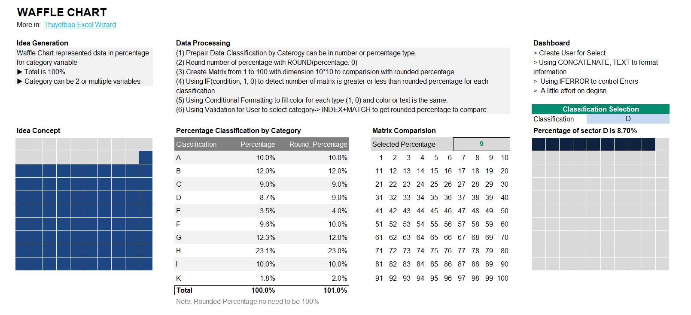

<!-- README.md is generated from README.Rmd. Please edit that file -->

# Excel Wizard 

**Excel Wizard** `(Shortcut EW)` is repo to contains Excel Dashboard
Demos, Excel Presentation introduced comprehensive approach with
components, formulas, process to work with Excel

### Guidance Flow

Guidance will consitent flows, examples like below:

    - Idea Generation: Short description about ideas related, data types and demo
    
    - Wrangle Data: Using various Excel formulas to establishment data, data structure, and process to make data
    
    - Dashboard: How to manage dashboard with some designs standard advices to create outperform - clearly - easy to use for user.

## Folder Structure

This repo has 3 main folders by their features: dashboard, presentation
and formula

## Get EW

You can download one by one examples by click into each file or folder
to download it. If you familar to Git, you can clone this projects by:

``` bash
# Clone with HTTPs
git clone https://github.com/thuyetbao/Excel-Wizard
```

## Examples

### Waffle



## TO DO

1.  Index Match Functional

2.  Array Function

3.  Working with Dates in Excel

## Source

I will included sources from Excel file that I has used to create
things.

## Maintainer

`EW` maintained by [Thuyet Bao](https://github.com/thuyetbao)
